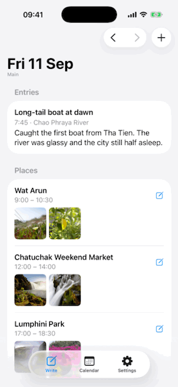

# Journey for iPhone

The iPhone app of [Journey](../README.md), a personal travel journal that
fills itself in as you go: it records the places you visit, pairs them with
the photos and videos you took there, and lets you write about each day — in
one journal or several. Commands below run from this `ios/` folder.



## What it does

- **Records where you go.** Place visits are captured in the background with
  almost no battery cost, and named automatically. Days from before you
  installed the app get their places back from where your photos were taken.
- **Matches your media to places.** Each place in a day shows the photos and
  videos taken there, straight from your library — nothing is copied.
- **A day at a glance.** Your entries, the places you visited and any
  leftover photos, with arrows to move between days.
- **Entries on your terms.** Title, place, time, notes, photos and videos — all
  optional. Tap the pencil on a place and the entry starts pre-filled with it,
  and adding media shows only what you shot that day.
- **Dictate instead of typing.** A mic button above the keyboard transcribes
  English or Italian on the phone, into whichever field you're in.
- **Translate between English and Italian** on the device. Translations sit
  alongside what you wrote and never replace it.
- **Drafts the story for you.** In the entry editor, Apple Intelligence writes
  a short first-person draft from the place, the time, your notes and what's
  in your photos — entirely on the phone, and kept apart from your own notes.
- **Read it like a journal.** The *Calendar* tab zooms from year to month,
  week and day; each day opens as a page — serif type on warm paper, photos
  laid out with the writing, and every photo or video a tap away from full
  screen.
- **Tags.** Define your own in *Settings* — family, friends, sport — tap them
  onto entries, and filter the calendar by one. They're also how sharing will
  work: an invite sees an entry only if it's allowed every tag on it, and
  untagged entries are for everyone.
- **More than one journal.** Everything goes to *Main* by default; add,
  rename and switch journals in *Settings*, and the one you're in shows under
  each screen's title. Settings also has a light / dark / system appearance
  switch.
- **Publish to your own website.** Add the website and its owner key in
  *Settings → Website*, then tap the globe on an entry in a journal page. You
  choose who can read it (only you, or the people you invite, limited by its
  tags) and how precisely its location shows — city by default. Photos are
  uploaded at up to 2048 pixels with their location and camera details
  removed. Videos up to 90 seconds are re-encoded at 720p with their location
  removed and uploaded too; longer ones stay on the phone. Nothing is published
  until you tap *Publish*, and a published entry can't be deleted until it's
  unpublished.

### On the way

- **Map view** with entries as pins that cluster as you zoom out.
- **Story proposals.** The website's API lets a custom ChatGPT GPT read your
  journal and propose richer narration, which you'll accept or reject in the
  app.

## How it works

### Recording where you go

[`LocationService`](Journey/Services/LocationService.swift) uses Core
Location's *visit* monitoring rather than continuous GPS. iOS reports each
visit twice — on arrival, then again on departure with the same arrival date —
so visits are keyed by arrival time and updated in place. Unknown times arrive
as `distantPast`/`distantFuture` sentinels and are mapped to "unknown".

The service is created when the app launches, not when a view appears: iOS
relaunches a terminated app in the background to deliver a visit, and there is
no UI at that point.

### Places from photos

Visit tracking only starts when the app is installed, and iOS never hands apps
your past location history. Photos carry their own time and GPS position, so
[`PhotoPlaces`](Journey/Services/PhotoPlaces.swift) rebuilds the missing
places when you open a day: each located photo that isn't already on a place
joins a photo-derived place within 250 m and two hours of it, or starts a new
one. The radius is the same distance the day view matches photos by, so every
photo lands on the place it created and reopening a day costs nothing.

[`PlaceNamer`](Journey/Services/PlaceNamer.swift) names places one lookup at a
time, because Apple throttles geocoding; a failed lookup is retried the next
time the day is opened. Photos without a location, like screenshots or saved
images, stay under *Other photos & videos*.

### Matching photos to places

[`DayTimeline`](Journey/Services/DayTimeline.swift) puts a photo under a
visit when it was taken between ten minutes before arrival and ten minutes
after departure, and — if the photo has a location — within 250 m of the
place. Anything left over is shown under *Other photos & videos*.

Entries store Photos library identifiers, not the media, so a journal stays
small and your library remains the single source of truth.

### Drafting the story on the device

Apple's on-device model reads text only, so
[`PhotoLabeler`](Journey/Services/PhotoLabeler.swift) first runs Vision's
image classifier over up to eight of the entry's photos (a still frame for
videos) and keeps the confident labels — *temple*, *boat*, *market*.
[`NarrativeDrafter`](Journey/Services/NarrativeDrafter.swift) then hands the
model the place, time, title, your notes and those labels, with instructions
to use only those facts and invent nothing, and streams the draft into the
editor as it's written.

The draft lives in its own `narrative` field. Your notes are never edited, and
the narrative remembers whether it came from the device or from you: edit the
draft and it becomes yours.

### Dictation, translation and the day picker

- [`Dictation`](Journey/Services/Dictation.swift) runs iOS 26's
  `SpeechAnalyzer` with a `DictationTranscriber`, so punctuation comes for
  free. The first time you dictate in a language, iOS downloads its speech
  model. Finished phrases are added to the field you're in; the one you're
  still saying shows in the bar above the keyboard.
- [`EntryTranslator`](Journey/Services/EntryTranslator.swift) sends the title,
  notes and story through Apple's Translation framework in one batch, and the
  framework works out the source language. The first translation may ask to
  download the language.
- The system photo picker can't filter by date, so
  [`DayPhotoPicker`](Journey/Views/DayPhotoPicker.swift) lists the entry's day
  straight from your library. *Browse All Photos* still opens the system picker
  for anything else.

### Data model

SwiftData stores journals, entries, visits, tags, publishing destinations and
outbox operations, plus cached publishing metadata. The versioned schema and
migration plan preserve stores from earlier releases. Every stored property
has a default and every relationship is optional, which keeps the model
CloudKit-compatible. For publishing, entries carry a stable ID (also the
website's), destination binding, publish state, audience, and location
precision.

## Running it on your iPhone

### What you need

- A Mac with **Xcode 26** and [XcodeGen](https://github.com/yonaskolb/XcodeGen)
  (`brew install xcodegen`).
- An **iPhone on iOS 26**. Drafting stories needs an Apple Intelligence
  iPhone (15 Pro or newer) with Apple Intelligence turned on; everything else
  works without it.
- An **Apple ID**. A free one works; the app then has to be reinstalled every
  7 days.

### Steps

1. Sign in to Xcode with your Apple ID (**Xcode → Settings → Accounts**).
2. Edit **`project.yml`**: set `bundleIdPrefix`, `DEVELOPMENT_TEAM`, and the
   two `PRODUCT_BUNDLE_IDENTIFIER`s to your own. A bundle identifier is unique
   across all of Apple, so `com.carlopascoli.journey` can't be reused. To find
   your Team ID:

   ```sh
   security find-identity -v -p codesigning \
     | sed -n 's/.*"\(Apple Development: .*\)"/\1/p' | head -1 \
     | xargs -I{} security find-certificate -c "{}" -p \
     | openssl x509 -noout -subject | tr '/' '\n' | grep '^OU=' | cut -d= -f2
   ```

3. Generate the project and open it:

   ```sh
   cd ios
   xcodegen generate
   open Journey.xcodeproj
   ```

4. Plug in your iPhone, pick it in the toolbar and press **⌘R**.
5. The first launch says *Untrusted Developer*: on the phone go to
   **Settings → General → VPN & Device Management**, tap your Apple ID and
   **Trust**.
6. When asked, allow location **Always** (visits are recorded in the
   background) and **Full Access** to photos.

`project.yml` is the source of truth: `xcodegen generate` overwrites the Xcode
project, so change targets and build settings there, not in Xcode's UI. The
source folders are Xcode *synchronised folders*, so a file added under
`Journey/` is picked up without regenerating.

### From the terminal

```sh
cd ios
xcodegen generate
xcodebuild -project Journey.xcodeproj -scheme Journey \
  -destination 'platform=iOS Simulator,name=iPhone 17 Pro' build
xcodebuild test -project Journey.xcodeproj -scheme Journey \
  -destination 'platform=iOS Simulator,name=iPhone 17 Pro' \
  -only-testing:JourneyTests CODE_SIGNING_ALLOWED=NO
```

`JourneyTests` covers stable local-day behavior, the durable publishing
outbox, and migration from each shipped SwiftData schema. The same generation
and test command runs in [iOS CI](../.github/workflows/ios.yml) on Xcode 26.
Website backup, key rotation, destination recovery and deployment procedures
are in the [operations runbook](../docs/operations.md).

## Demo mode

Debug builds launched with `-demo` use an in-memory store seeded with a short
Bangkok trip ([`DemoData`](Journey/Demo/DemoData.swift)), so your real journal
is never touched. The `Journey-Demo` scheme passes the flag for you.

## Regenerating the demo

Run this **by hand**, from `ios/`, and only when a change is worth showing.
Each recording commits a new binary, and the GIF stays accurate across most
changes.

```sh
Tools/record-demo.sh                          # defaults
SPEEDUP=2 FPS=8 WIDTH=280 KEEP_CAPTURE=1 \
  Tools/record-demo.sh                        # retune the encoding
```

The script erases a dedicated **Journey Demo** simulator (created on first
run), stamps the simulator's sample photos with today's times and the demo
places' coordinates
([`stage-demo-photos.swift`](Tools/stage-demo-photos.swift)), answers the
permission prompts off camera, then records
[`DemoWalkthrough`](JourneyUITests/DemoWalkthrough.swift) and writes
`Docs/demo.gif`. The walkthrough prints wall-clock markers when it starts and
finishes, and the GIF is trimmed to them, so the test runner's slow start-up
never makes it into the file.

[`make-gif.swift`](Tools/make-gif.swift) needs nothing beyond the system
frameworks. It merges identical consecutive frames into one longer frame, which
is what keeps the pauses between steps from bloating the file.

The app icon — a sunset chedi over the Andaman Sea, with dark and tinted
variants — is generated too (from `ios/`):

```sh
swift Tools/make-icon.swift
```

## Simulator limits

- The simulator never produces tracked visits; iOS only records them from real
  movement, so test tracking on a phone. Places rebuilt from photos work
  anywhere the photos have locations.
- On iOS 26, `simctl privacy grant photos` doesn't stop the photo prompt, so
  answer it once by hand.
- The simulator borrows the Mac's Apple Intelligence model, so drafting only
  works there on a Mac running macOS 26 with Apple Intelligence on. Otherwise
  the editor explains why the button is disabled.
- Dictation and translation depend on on-device language models too; try them
  on a phone.

## Caveats

This is a personal project, not something to ship. It holds a detailed record
of where you've been. Data stays on the device unless you explicitly tap
*Publish*; published locations default to city level.
